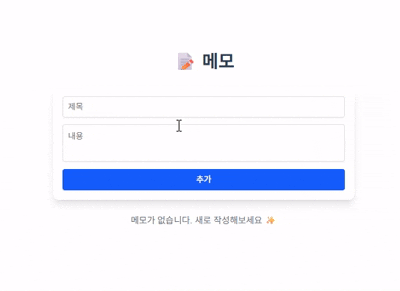

# Notes Vue.js

간단한 **메모장 웹 애플리케이션**입니다.  
Vue 3 + Vite + TailwindCSS를 기반으로 제작되었으며, 브라우저 **LocalStorage**를 활용해 메모를 저장/삭제할 수 있습니다.

---

## 주요 기능

- ✅ 메모 작성 (제목 + 내용 입력)
- ✅ 메모 삭제
- ✅ LocalStorage 저장 (새로고침해도 데이터 유지)

---

## 기술 스택

- **Frontend Framework**: [Vue.js 3](https://vuejs.org/)
- **Build Tool**: [Vite](https://vitejs.dev/)
- **Styling**: [TailwindCSS](https://tailwindcss.com/)
- **State Management**: Vue의 `reactive`, `watch` 사용
- **Storage**: LocalStorage

---

## 미리보기

  

